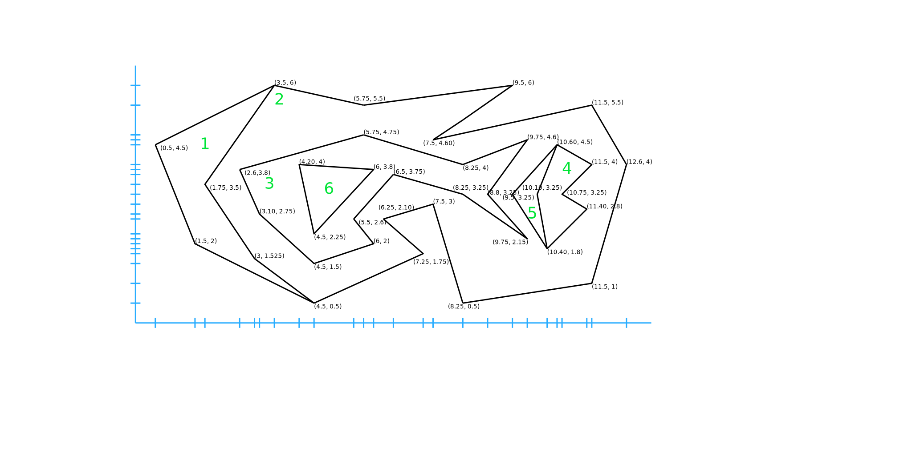
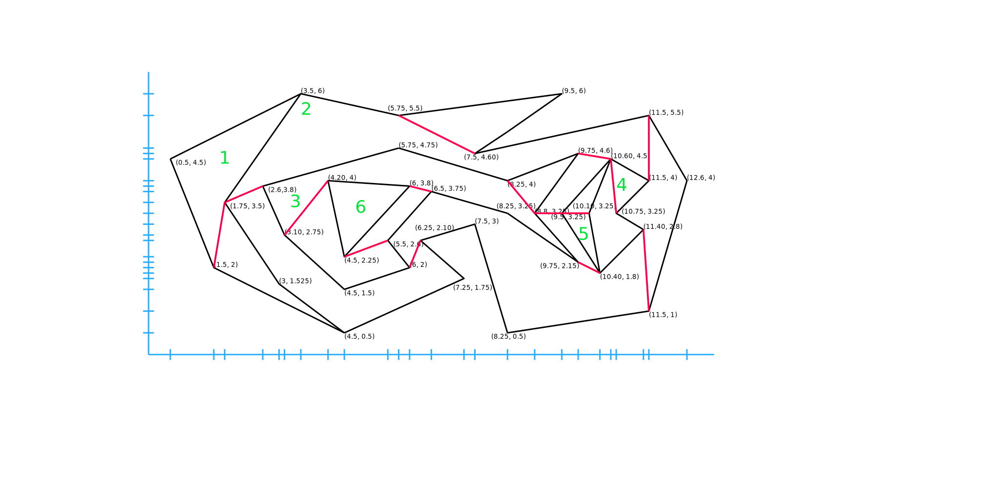

# Monotone decomposition of a planar subdivision
An example usage of the computational geometry library 
CGAL to compute a monotone decomposition 
for a planar subdivision.

Requires CGAL to be installed.